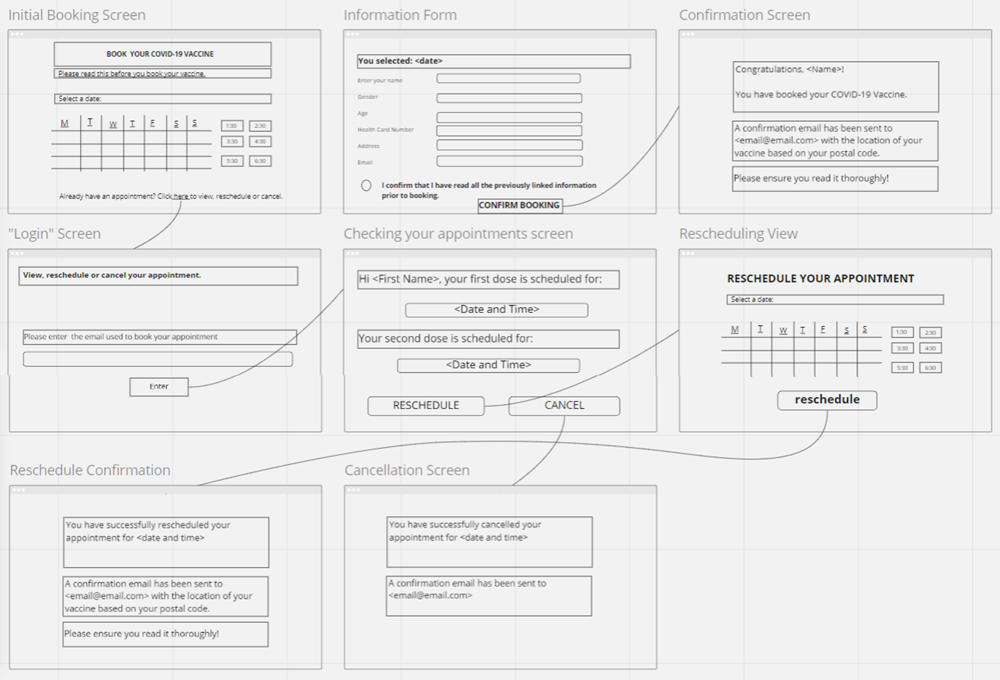
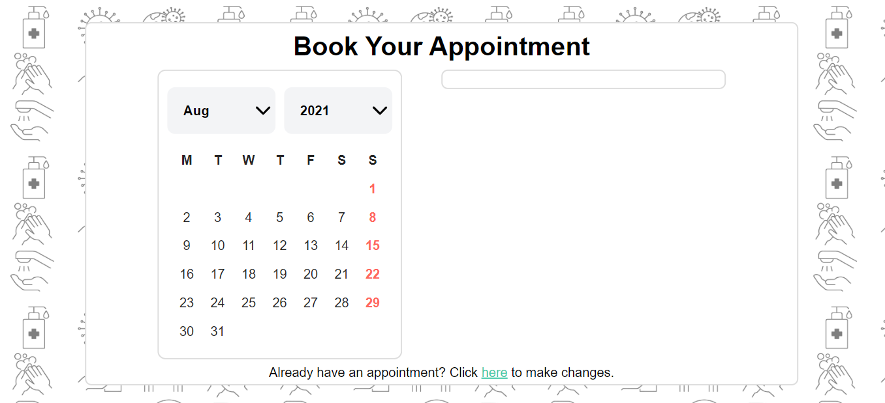
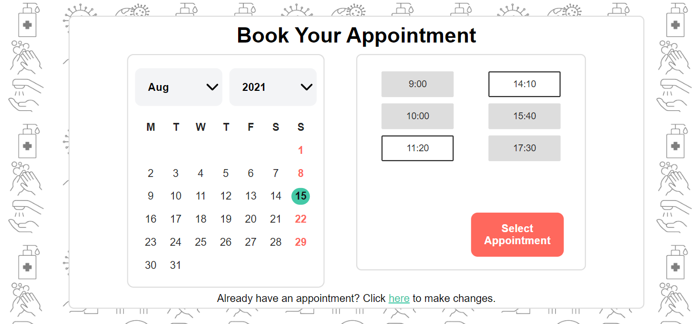

# Appointment Scheduler Design

TOOLS USED:  

<a href="https://codepen.io/lauratatianatoro/project/editor/XLQbwn"><strong>Live Demo</strong></a>

This assignment guides students through begining stages of design using User Experience principles and usability goals.

We begin with low fidelity sketches of a COVID-19 Vaccine Scheduler and translate them into a mid fidelity demo. 
JavaScript is used to simulate communication with a database (i.e, dates divisible by 2 activate certain timeslots available)

More steps are necessary to take this project to completion.

## Low Fidelity Design

## High Fidelity Design

Onload:  

 
OnClick:  

<!-- ACKNOWLEDGEMENTS -->
## Acknowledgements

* [MrNobody's Calendar](https://codepen.io/corvus-007/pen/MzEKyJ)

